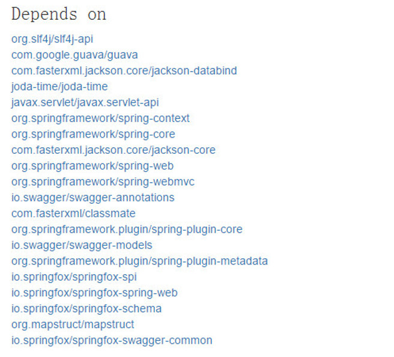

# **`springfox-swagger2`**
> `swaggerUI + springmvc 2.0`版本

## `demo`

>[**`http://172.16.8.60:8080/swagger2`**](http://172.16.8.60:8080/swagger2)

> `demo`中集成了springfox.petstore的示例代码，可以参考使用或者直接查看`API`文档。

## `maven`方式添加
```xml
    <dependency>
    	<groupId>io.springfox</groupId>
    	<artifactId>springfox-swagger2</artifactId>
    	<version>2.6.1</version>
    </dependency>
```
## 依赖关系

> 具体在`maven`搜索页面浏览： **[`mavensearch.io`](http://mavensearch.io/repo/io.springfox/springfox-swagger2/2.6.1)**
> 如果不使用`maven`等配置文件的方式添加依赖包，则需要手动将依赖的`jar`添加到开发环境中

## 构造配置类
```java
    
    package com.gosuncn.web.swagger.SwaggerConfig
    import org.springframework.context.annotation.Bean;
    import org.springframework.context.annotation.Configuration;
    import org.springframework.web.servlet.config.annotation.EnableWebMvc;
    
    import springfox.documentation.service.ApiInfo;
    import springfox.documentation.spi.DocumentationType;
    import springfox.documentation.spring.web.plugins.Docket;
    import springfox.documentation.swagger2.annotations.EnableSwagger2;
    
    
    @Configuration
    @EnableWebMvc
    @EnableSwagger2
    //@ComponentScan(basePackages = {"com.gosuncn.web"})
    public class SwaggerConfig {
    
    	@Bean
    	public Docket swaggerSpringMvcPlugin(){
    		Docket docket = new Docket(DocumentationType.SWAGGER_2);
    		ApiInfo apiInfo = new ApiInfo("Restfull API","", null, null, null, null, null);
    		docket.apiInfo(apiInfo);
    		return docket;
    	}
    
    }
```

**Reference：**

<i class="icon-link"></i> **[`Docket Spring Java Configuration`](http://springfox.github.io/springfox/docs/current/#docket-spring-java-configuration)**

<i class="icon-link"></i> **[`transitioning-to-v2.md`](https://github.com/springfox/springfox/blob/master/docs/transitioning-to-v2.md)**


## 上下文容器配置

在`applicationContext.xml`文件中添加以下配置项
```xml
    <bean name="applicationSwaggerConfig" class="com.gosuncn.web.swagger.SwaggerConfig" />
```    
## 如果需要开启 `CORS`支持，在`Tomcat`的`web.xml`文件中添加以下配置  
```xml
   <filter>
	  <filter-name>CorsFilter</filter-name>
	  <filter-class>org.apache.catalina.filters.CorsFilter</filter-class>
	</filter>
	<filter-mapping>
	  <filter-name>CorsFilter</filter-name>
	  <url-pattern>/*</url-pattern>
	</filter-mapping>
```

## 运行
> - 启动项目，浏览器中输入项目链接，如：`localhost:8080/swagger2-springmvc/`。

> - `swagger-springmvc`已将`SwaggerUI`集成到项目中，输入上述链接时，服务将定位到`localhost:8080/swagger2-springmvc/docs/index.html`。

> - 可以定位到`webapp/docs`目录下浏览`SwaggerUI`文件。

> - 如果`SwaggerUI`集成到服务中，应该取消`CORS`支持，否则无法通过`localhost`的方式访问接口服务。

> - `SwaggerUI`独立于项目的情况，即`SwaggerUI`和接口服务分别部署在不同服务器下时，接口服务需要启动`CORS`支持。打开[`http://172.16.8.60:8080/apis/`](http://172.16.8.60:8080/apis/),并填入`Restfull API`服务链接即可。

> - 接口服务请求路径格式：`http://[host]:[port]/[projectName]/v2/api-docs`。 如 http://172.16.8.60:8080/swagger2/v2/api-docs

## 相关文档/`API`
 - [`springfox github`](https://github.com/springfox/springfox)
 - [`springfox-swagger2`](https://github.com/springfox/springfox/tree/master/springfox-swagger2/src/main/java/springfox/documentation/swagger2)
 - [注解文档`wiki`](https://github.com/swagger-api/swagger-core/wiki/Annotations-1.5.X)
